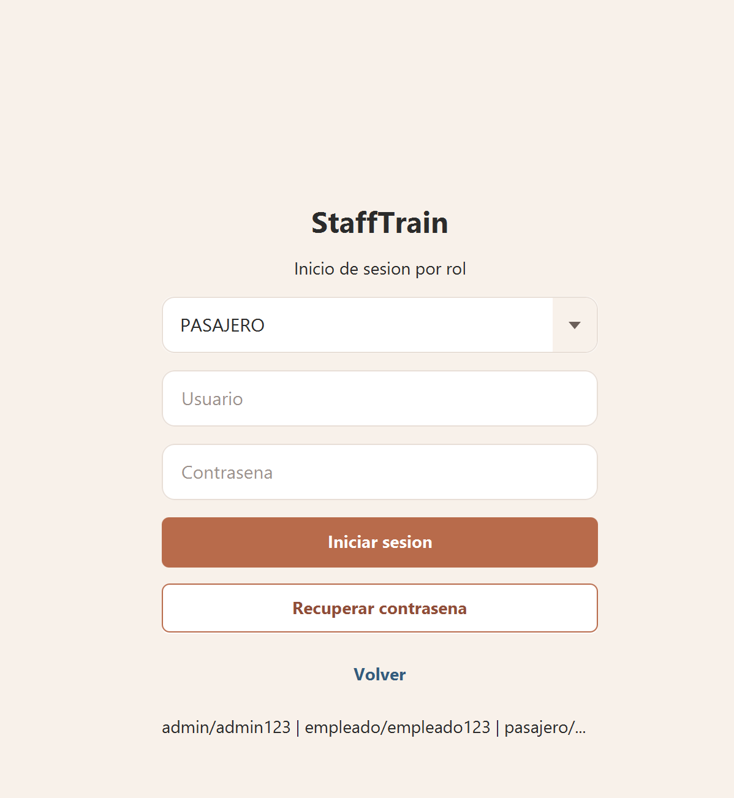

# Security Policy

## Proyecto académico

StaffTrain es un proyecto académico de escritorio construido con JavaFX, Maven y persistencia local en JSON. No debe considerarse listo para producción sin una revisión de seguridad, manejo robusto de credenciales y endurecimiento de persistencia.

## Reporte responsable

Si encuentras una vulnerabilidad, no abras un issue público con datos sensibles, credenciales, rutas privadas o pasos que permitan explotación directa.

Reporta el hallazgo de forma privada a:

```text
[correo-de-contacto]
```

Incluye:

- Descripción clara del problema.
- Pasos para reproducirlo.
- Módulo afectado.
- Impacto esperado.
- Evidencia mínima, sin exponer datos reales.

## Alcance

Se consideran dentro del alcance:

- Validación de entradas en formularios JavaFX.
- Manejo de credenciales de prueba.
- Lectura y escritura de archivos JSON locales.
- Persistencia en `data/json`.
- Navegación entre vistas FXML.
- Control de roles: pasajero, empleado y administrador.

Fuera del alcance:

- Ataques contra infraestructura externa.
- Despliegues productivos no documentados.
- Integraciones con bases de datos o servicios cloud, porque el proyecto no las usa.

## Versiones soportadas

| Versión o rama | Soporte |
|---|---|
| `feature/stafftrain-app-completa` | Versión académica en desarrollo |
| Ramas históricas | Sin soporte formal |

## Buenas prácticas

- No subir datos personales reales a `data/json`.
- No subir credenciales reales.
- No usar contraseñas de prueba fuera del entorno académico.
- No publicar capturas con rutas locales sensibles.
- No usar la aplicación en producción sin autenticación segura, cifrado y control de acceso reforzado.
